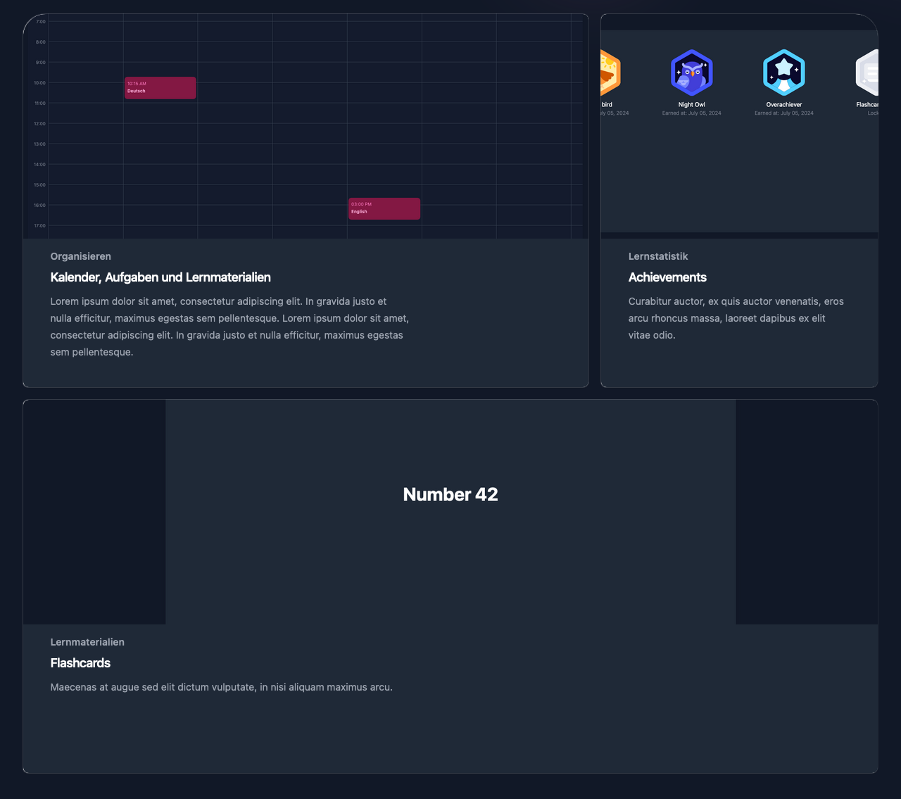

# Lernmit

A online learn platform for schools



## Getting Started

### Prerequisites

- [Elixir](https://elixir-lang.org/install.html)
- [Node.js](https://nodejs.org/en/download/)
- [PostgreSQL](https://www.postgresql.org/download/)
- [Phoenix](https://hexdocs.pm/phoenix/installation.html)
- [Docker](https://docs.docker.com/get-docker/)

### Installation

Install dependencies

```bash
mix deps.get
cd assets && npm install
```

Run setup

```bash
mix setup
```

Start the server

```bash
mix phx.server
```

## License

This program is licensed under the Business Source License 1.1. See the "LICENSE" file for more information